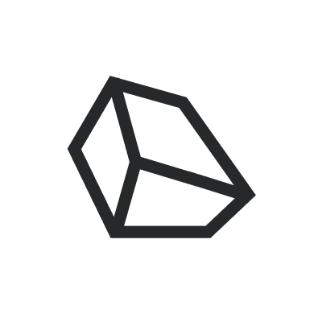

  

<h1 align="center">
  Template
</h1>

  This is where you will put the one-line description of your awesome project.

  

  

 

## Summary and features

Here you will put a more detailed description of the project.

- project goals
- important features

## Getting started

- install dependencies: `npm ci`
- run tests to verify that everything is working: `npm test`
